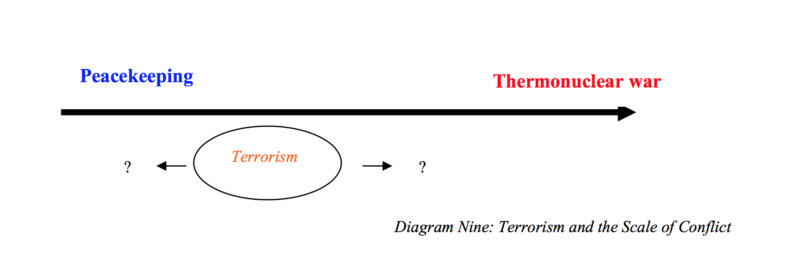
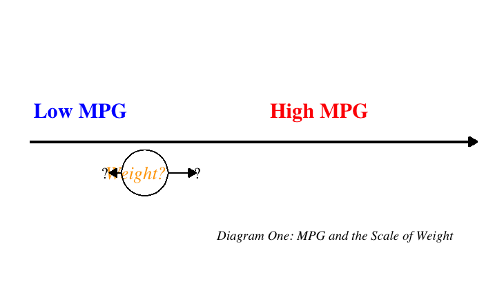

## gorkaplot

Welcome to gorkaplot. This library exists to fill a gap in the R programming environment for easily replicating the following famous figure from Sebastian Gorka's dissertation:



This library contains a single function, gorkaplot, which takes six arguments:
+ **data**: A dataframe
+ **x**: The name of the x variable, as a character string
+ **y**: The name of the y variable, as a character string
+ **xmin_lab**: A character string label for the lower end of the range of the x variable
+ **xmax_lab**: A character string label for the upper end of the range of the x variable
+ **y_var_lab**: A character string label for the y variable
+ **caption**: A text string to use as a caption, including diagram number

These plot settings were built on the following assumptions. Below the primary arrow in the original plot is a text string, ``Terrorism,'' with two arrow segments branching out on either side. Above the primary arrow are two character strings describing the ends of an apparently ordinal scale ranging from ``Peacekeeping'' at the lower end to ``Thermonuclear war'' at the upper end. These choices indicate that ``Terrorism,'' according to the argument being presented visually, causes an observation to move up or down the ``peace-to-war'' scale. That would imply that ``terrorism'' is the independent variable and ``peace-to-war'' is the  dependent variable (``terrorism'' *causes* movement along ``peace-to-war''). Thus, while the blue and red text would intuitively represent two ends of the x-axis, the one typically presented along the horizontal dimension of a two-dimensional figure, this is no ordinary plot style.

The following example produces a gorkaplot of the `mtcars` data.

```{r}
library(devtools)
install_github(``johnlray/gorkaplot'')
library(gorkaplot)

data(mtcars)

gorka_plot(mtcars, x = "wt",
          y = "mpg",
          x_var_lab = "Weight?",
          ymin_lab = "Low MPG",
          ymax_lab = "High MPG",
          caption = "Diagram One: MPG and the Scale of Weight"
          )
```



